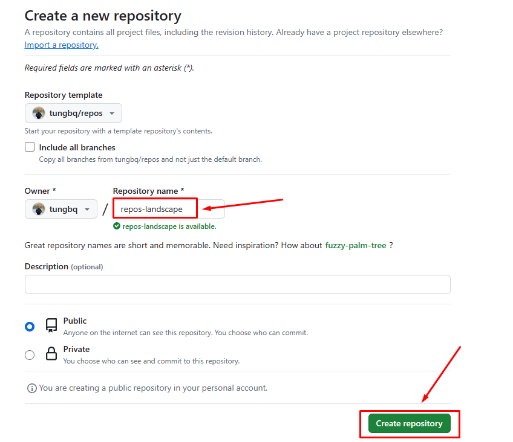
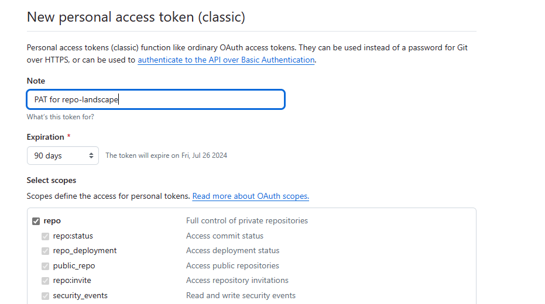
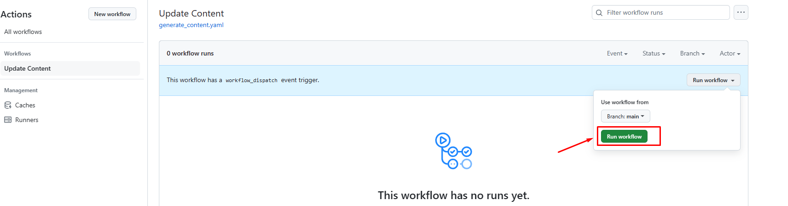

# Use the template

This instruction will describe the feature and guide you how to use this repo template to create your own repos landscape

## Key Features

This template provides some features that help you create your repo landscape content automatically:

- Supports defining the list of repositories to be shown in the landscape, file `repository_list.txt`.
- Automated script to generate content from the `repository_list.txt`.
- A CI pipeline to generate new repository landscape content:
  - Triggers the automated generation script.
  - Creates a pull request to propose the new content.
- The repository landscape format provides:
  - Indexing with repo name title
  - Repo URL
  - Repo description
  - A GitHub stars badge

## Quick start

If you want to generate the content locally, update the `repository_list.txt` and run this script:

```bash
git clone https://github.com/tungbq/repos.git
cd repos
./generate_content.sh repository_list.txt
```

Result will be similar to:

```bash
➜  repos git:(main) ✗ ./generate_content.sh repository_list.txt
Working on repo: tungbq/devops-basics, with index: 1
Working on repo: tungbq/AWSHub, with index: 2
Working on repo: tungbq/devops-toolkit, with index: 3
Working on repo: tungbq/devops-project, with index: 4
Working on repo: tungbq/aws-lab-with-terraform, with index: 5
Working on repo: tungbq/awesome-workflow, with index: 6
Working on repo: tungbq/k8sHub, with index: 7
Working on repo: tungbq/Azure-DevOps-Pipeline, with index: 8
Working on repo: tungbq/find-github-issue, with index: 9
Working on repo: tungbq/challenges, with index: 10
Working on repo: tungbq/devops-dockerfiles, with index: 11
Working on repo: tungbq/terraform-sample-project, with index: 12
Working on repo: tungbq/repos, with index: 13
```

Now check the README.md and you would find your repository landscape content

## Configure and use the template

Below steps help you create and configure your own landscape repository

### 1. Create new repo from template

- Visit the template repository: https://github.com/tungbq/repos
- At the right corner, select `Use this template` > `Create a new repository`:

  

- Input your repo name to create, and the description if needed, then select `Create repository`
  

- Wait for a few seconds, then your repository will be created

### 2. Configure Personal Access Token (PAT) for new repo

There is a CI workflow to auto generate the content and open the new Pull request for your repository landscape, so setup PAT is required

#### 2.1. Generate the token

- Click on your profile on the top right corner > `Settings` > `Developer Settings`, or visit: https://github.com/settings/tokens
- Select `Generate new token`

  

- Set the expiration day, my personal choice 90days. You can set to whatever you want
- Select scopes `repo` only for better security

  

- Then click `Generate token`
- Finally copy or note the newly created token somewhere for later use

#### 2.2. Create the PAT token variable

- Go to Actions secrets and variables
- Visit: https://github.com/tungbq/repos-landscape/settings/secrets/actions

- Select `New repository secrets` section, then input PAT to the name and the token

  

- Once completed, you will get the result similar to:

  

Now we are ready to trigger the CI workflow to update the repo landscape

### 3. Update your repository list

- Add your repo list into file `repository_list.txt` in your repo and merge to `main`

### 4. Trigger the CI pipeline

- Go to Action, select `Update content`
- Select run workflow to trigger the CI:

  

- The CI pipeline will read the repository list, then generate your new readme content.
- Then it checks and creates a Pull Request to propose the new repository landscape content.

### 5. Review and merge the PR

Once the PR is raised automatically, you just need to review and merge and that's it you will have your own landscape content in README.md
