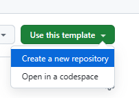
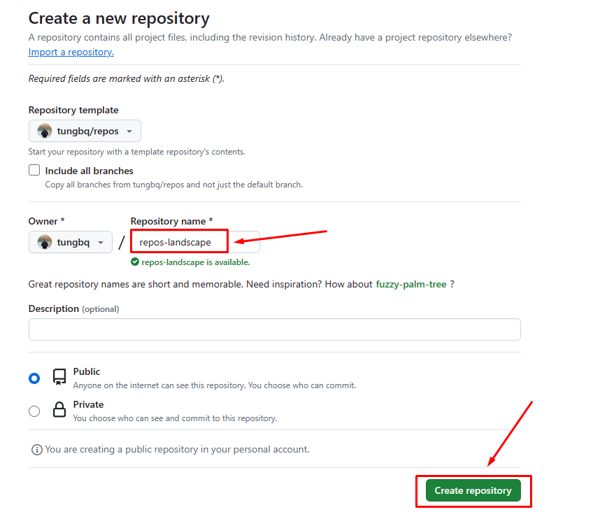
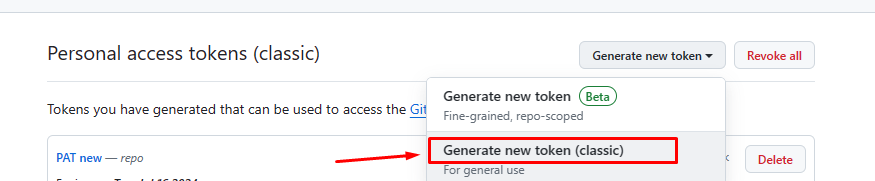
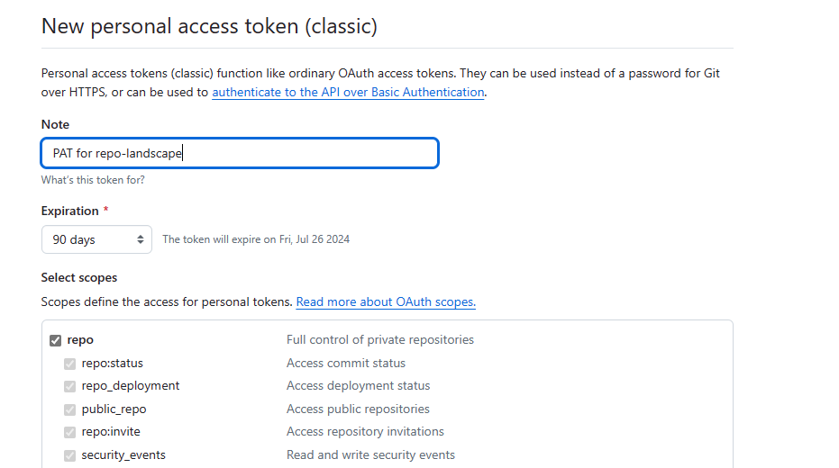
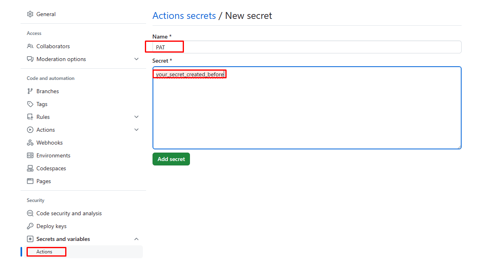
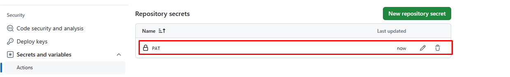
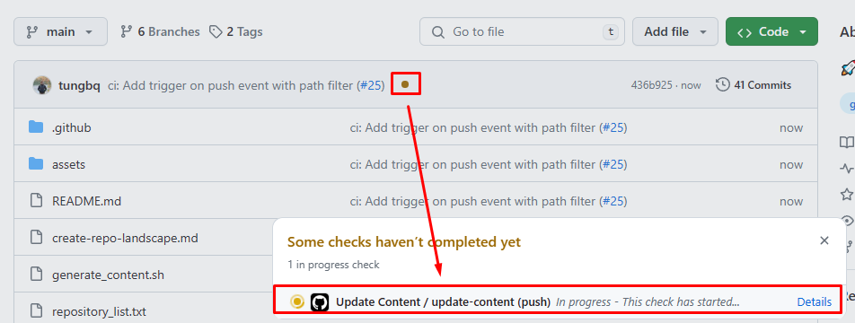
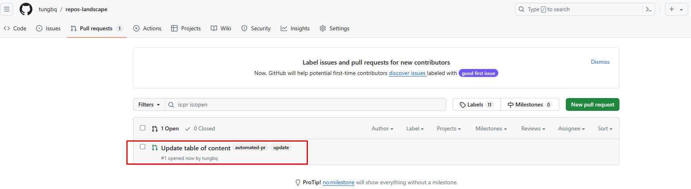
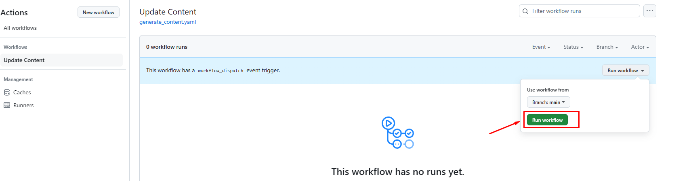
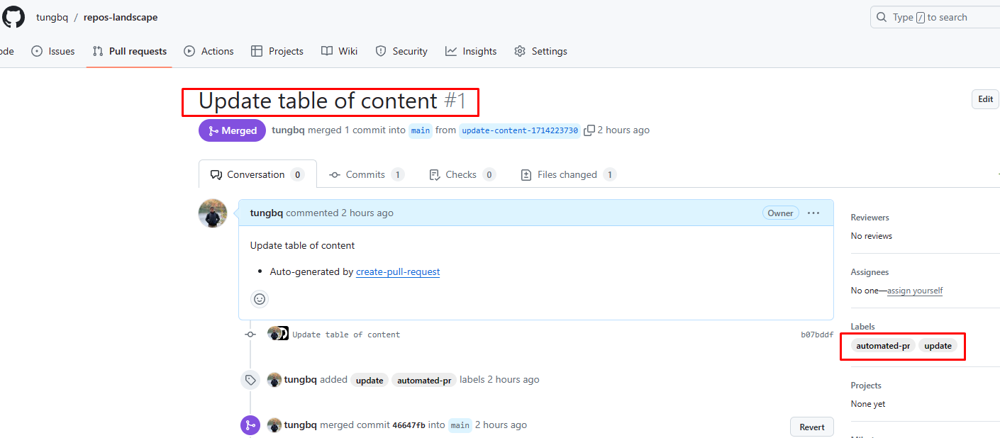

# Create your repo landscape

This instruction will describe the feature and guide you on how to use this repo template to create your own repository landscape.

## Key Features 🚀

This repository template provides some features that help you create your repo landscape content automatically:

- Supports defining the list of repositories to be shown in the landscape, file `repository_list.txt`.
- Automated script to generate content from the `repository_list.txt`.
- A CI pipeline to generate new repository landscape content:
  - Triggers the automated generation script.
  - Creates a pull request to propose the new content.
- The repository landscape format provides:
  - Indexing with repo name title
  - Repo URL
  - Repo description
  - A GitHub stars badge

## Quick start 📖

This is optional; you can skip this section and jump into `Configure and use the template 📘` to create your own repo.
If you want to generate the content locally, update the `repository_list.txt` and run this script:

```bash
git clone https://github.com/tungbq/repos.git
cd repos
./generate_content.sh repository_list.txt
```

Result will be similar to:

```bash
➜  repos git:(main) ✗ ./generate_content.sh repository_list.txt
Working on repo: tungbq/devops-basics, with index: 1
Working on repo: tungbq/AWSHub, with index: 2
Working on repo: tungbq/devops-toolkit, with index: 3
Working on repo: tungbq/devops-project, with index: 4
Working on repo: tungbq/aws-lab-with-terraform, with index: 5
Working on repo: tungbq/awesome-workflow, with index: 6
Working on repo: tungbq/k8sHub, with index: 7
Working on repo: tungbq/Azure-DevOps-Pipeline, with index: 8
Working on repo: tungbq/find-github-issue, with index: 9
Working on repo: tungbq/challenges, with index: 10
Working on repo: tungbq/devops-dockerfiles, with index: 11
Working on repo: tungbq/terraform-sample-project, with index: 12
Working on repo: tungbq/repos, with index: 13
```

Now check the README.md and you would find your repository landscape content

## Configure and use the template 📘

Below are the steps to help you create and configure your own landscape repository.
<br>
In short we only need to do 4 major steps: `Create new repo from template` > `Set up PAT` > `Update repository list` > `Merge the automated PR`.
<br>
Let's dive into the detailed as below:

### 1. Create a new repo from the template

- Visit the template repository: [https://github.com/tungbq/repos](https://github.com/tungbq/repos).
- In the top right corner, select `Use this template` > `Create a new repository`:

  

- Input your repository name to create and add a description if needed, then select `Create repository`.

  

- Wait for a few seconds, and your repository will be created.

### 2. Configure Personal Access Token (PAT) for the new repo

There is a CI workflow to automatically generate content and open a new Pull Request for your repository landscape, so setting up a PAT is required.

#### 2.1. Generate the token

- Click on your profile in the top right corner > `Settings` > `Developer settings`, or visit: [https://github.com/settings/tokens](https://github.com/settings/tokens).
- Select `Generate new token`.

  

- Set the expiration date (my personal choice is 90 days; you can set it to whatever you want).
- Select only the `repo` scope for better security.

  

- Then click `Generate token`.
- Finally, copy or note the newly created token somewhere for later use.

#### 2.2. Create the PAT token variable

- Go to `Settings` > `Secrets and variables` > `Actions`
- Visit: https://github.com/<your_username>/<your_new_reponame>/settings/secrets/actions
- In the `New repository secrets` section, input the PAT as the name and the token.

  

- Once completed, you will see a result similar to this:

  

Now we are ready to trigger the CI workflow to update the repo landscape.

### 3. Update your repository list

- Add your repository list to the file `repository_list.txt` in your repository and merge it into the `main` branch, for example:

```
tungbq/devops-basics
tungbq/AWSHub
tungbq/devops-toolkit
tungbq/devops-project
tungbq/aws-lab-with-terraform
tungbq/awesome-workflow
```

### 4. Trigger the CI pipeline

#### Automatically trigger on merge event to main

- Once the `repository_list.txt` is merged into the `main` branch, the CI pipeline Update content will be triggered automatically.

  

- The CI pipeline will read the repository list and generate your new `README.md` content.
- Then, it will check and create a Pull Request to propose the new repository landscape content.

  

#### Manual trigger (Optional)

- You can also trigger that CI at any moment you want.
- Go to Actions and select Update content.
- Select "Run workflow" to trigger the CI:

  

### 5. Review and merge the PR

Once the PR is raised automatically, you just need to review and merge, and that's it! You will have your own landscape content in README.md.



Congratulations 🎉, you've successfully created your own repo landscape! Now check the `README.md` for the final result.

## Advance CI configuration (Optional)

- In the previous section, we triggered the CI pipeline to run on a merge event to `main` branch or manual event. You could improve that by changing the trigger event to run on a timer basis. For example, once a week or once a month. This would help us regularly check and update the landscape, keeping it up to date.
- To do so, add your desired cron trigger to `repos/.github/workflows/generate_content.yaml`

```yaml
on:
  schedule:
    - cron: '0 0 * * 6' # Run every Saturday at midnight
  workflow_dispatch:
  # other events as needed
```

- Check https://crontab.guru/ for the CRON syntax
